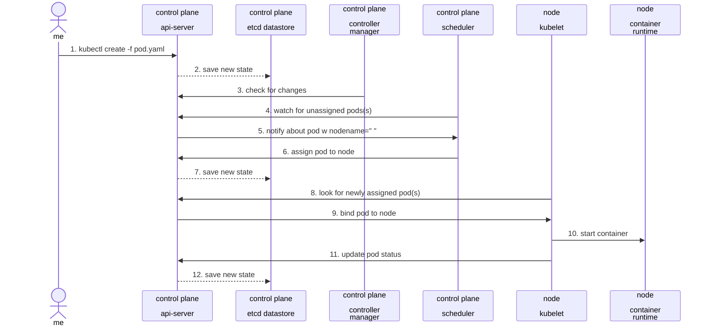
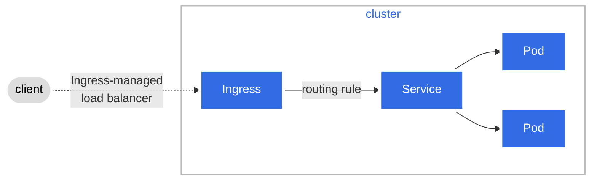

# Overview
Github Project: [AWX on K3s or Minikube](<https://github.com/jacobbweber/self-study/tree/main/awx-on-minikube%20or%20k3s>)

I have spent some time learning about container orchestration and Kubernetes, but haven't had much opportunity to really dive in and try to apply what I've learned in a simple way. Planning out my future "HomeLab" project I will have the need of some automation tools. I already planned on using Ansible but thought it would be a great reason to setup Ansible (AWX) instead.

For these learning activities I utilized the "AWX Operator" which is meant to provide a more Kubernetes-native installation method for AWX via an AWX Custom Resource Definition (CRD). And for a Kubernetes learning environment, I used both minikube and k3s which provide a simplified, lightweight Kubernetes environment, ideal for learning and experimentation purposes. Incorporating AWX offered hands-on experience with automation and management of IT systems. This project served as an excellent resource for practical learning in cloud computing, DevOps, and infrastructure automation.

After working through the project and getting it mostly functional, I found it interesting that between minikube and k3s there wasn't much difference in (making it go). At least for as far as I scratched this surface. I was able to pretty quickly setup either minikube or k3s and apply the manifests just as easy between the two. This wasn't immediately obvious to me while choosing a learning environment, but makes sense now.

## Thoughts on random things I learned during this project

While working on this I kept trying to visualize how these components are working together. It helped me to note what each component is for to keep them separate in my mind. And draw some diagrams to refer to along the way. This is an example of how I did that.

The setup involving AWX Operator and Minikube with Kustomize, the workflow looked like this:

> - **Minikube or k3s**: Acts as the Kubernetes environment, hosting all other components.
>
> - **kubectl**: is a command-line tool for interacting with a Kubernetes cluster, allowing you to deploy applications, inspect and manage cluster resources, and view logs. It's a direct interface for the Kubernetes API.
>
> - **Kustomize**: Used for customizing Kubernetes configurations, relevant for setting up environments in Minikube.
>
> - **AWX Operator**: A Kubernetes operator for AWX, responsible for deploying and managing AWX instances within the Kubernetes cluster.
{: .prompt-info }

Using mermaid you can create diagrams in markdown easily.




### Secrets

In this example I learned there are two ways to handle secrets: using individual files and using the SecretGenerator feature in Kustomize.

1. Individual Files: This method involves creating separate files for each secret. Each secret is defined and stored in its own file, which can then be manually applied to the Kubernetes environment.

2. SecretsGenerator in Kustomize: This is a more automated approach where Kustomize SecretGenerator is used to create Kubernetes secret objects. It allows for defining multiple secrets in a more structured and consolidated manner, typically within a single configuration file, which Kustomize then processes to generate the necessary Kubernetes secret objects.

The choice between these methods depends on the complexity and scale of the project. Individual files might be simpler for very small projects, while SecretGenerator offers better organization and scalability for larger setups.

Following the awx-operators documentation they lead you to make individual files, which is where I started in my V1 folder, but ultimately went the route of SecretsGenerator in the V2 folder.

### Overlays

In Kustomize, "Bases" and "Overlays" are concepts used to manage and customize Kubernetes configurations:

Bases: These are the foundational configurations, typically the common, core settings required for a Kubernetes application. Bases include the basic resources like Deployments, Services, and ConfigMaps.

Overlays: Overlays are modifications or environment-specific customizations applied to the base. They allow for variations like development, staging, and production configurations, each potentially having different resource requirements, environment variables, etc.

I plan to implement this functionality in a more complete version of this project where I would use Bases and Overlays for the AWX operator with a dev and production environment, my file/folder structure could look like this:

Base Directory: Contains common configurations for both environments.

```shell
base/
├── kustomization.yaml
├── deployment.yaml
├── service.yaml
```

Dev Overlay: Customizes the base for the development environment.

```shell
overlays/
├── dev/
│   ├── kustomization.yaml
│   ├── dev-specific-config.yaml
```

Production Overlay: Customizes the base for the production environment.

```shell
├── prod/
    ├── kustomization.yaml
    ├── prod-specific-config.yaml
```

In overlays/dev/kustomization.yaml and overlays/prod/kustomization.yaml, you'd reference the base and include environment-specific modifications. This structure allows you to manage common configurations in the base while maintaining environment-specific adjustments in the overlays.

### Ingress controllers

When I walked through the setup for awx on k3s it worked great, I used mostly defaults and didn't have much issues.

When I went to repeat it on minikube, I ran into an issue utilizing the ingress_type: ingress because by default the provided ingress controller on minikube is disabled, requiring you to enable it, where as on k3s the default is enabled and uses Traefik.

I would'nt say this is super critical for learning purposes, but it led me down a lengthy path of reading to realize there are more options.

When using K3s or Kustomize for Kubernetes, several ingress controller options are available to you:

- Traefik: K3s comes with Traefik as its default ingress controller. It's known for its simplicity and automatic HTTPs configuration.

- Nginx Ingress Controller: A popular choice for Kubernetes, offering flexibility and a wide range of features.

- HAProxy Ingress Controller: Known for high performance and efficiency, particularly in high-traffic environments.

- Contour: Utilizes Envoy proxy, offering a modern, high-performance approach to ingress control.

- Istio Ingress Gateway: For those implementing a service mesh, this provides advanced routing and control features.

Each of these options has its own set of features and configurations, and the best choice depends on your specific requirements and environment.



### Flannel

While researching the k3s installation script they provide, I saw a few references and some examples specifying flannel-options as optional command line parameters. It turns out this wasn't anything to do with a flannel shirt like I was picturing in my head.

Flannel is a simple and easy-to-use network fabric for Kubernetes, providing several backend options to fit different network requirements:

- VXLAN: The default backend, it encapsulates network traffic in a virtual network over the existing network infrastructure.
- Host-gw: Creates a simple route-based network, providing efficient traffic routing.
- UDP: An older backend, using UDP to encapsulate traffic, less efficient and generally not recommended.
- AWS VPC: Integrates directly with the AWS VPC network, for AWS-hosted Kubernetes clusters.

Each backend option has its unique characteristics and performance implications, and the choice depends on the specific needs and constraints of your Kubernetes environment.

Glen Kosaka over at SUSE has a great blog worth checking out.
[How Kubernetes Networking Works - Under the Hood](https://www.suse.com/c/advanced-kubernetes-networking/)


Thats it for now. As I continue to learn new things on this topic, I will update this post with my thoughts.
