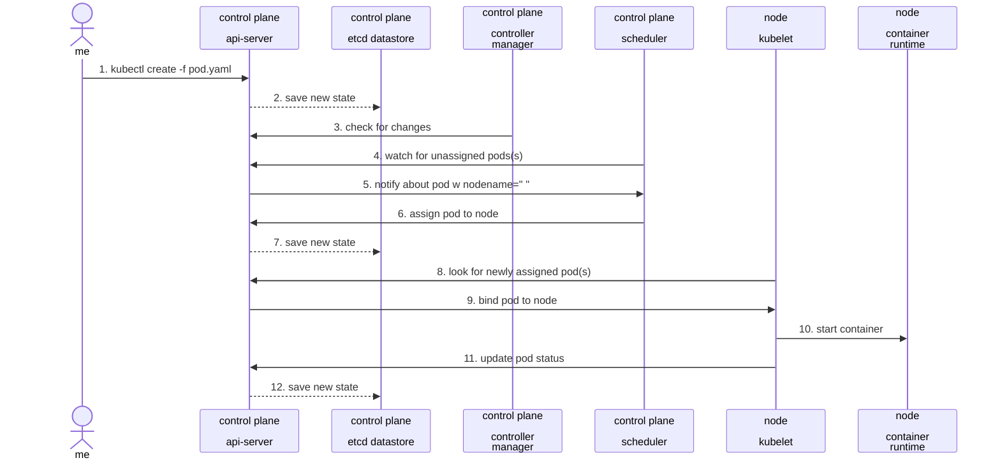

# Overview

Github Project: [Learning-AWX-Setup](https://github.com/jacobbweber/learning-awx-setup)

As I planned my upcoming "HomeLab" project, which requires certain automation tools, I decided not only to use Ansible but also to set up Ansible (AWX), seeing it as an excellent opportunity for setup and learning.

I'm sure like many others interested in using AWX, my journey began with an attempt to install it, but surprisingly, it led me to explore Kubernetes instead. In my GitHub project, I've provided a condensed overview of the subjects I'll be discussing in this article. The purpose of this article is to thoroughly document my learning process, including the strategies I employed in this project and the valuable knowledge I acquired.

During these learning activities, I utilized the "AWX Operator", a Kubernetes-native installation method for AWX via an AWX Custom Resource Definition (CRD). To create a learning environment for Kubernetes, I used both minikube and k3s, which are lightweight and simplified Kubernetes environments, perfect for learning and experimentation. Implementing AWX provided me with practical experience in automation and managing IT systems. This project proved to be an invaluable resource for hands-on learning in cloud computing, DevOps, and infrastructure automation.

In my github project there are multiple versions of this deployment.
- awx-on-minikube: Final setup utilizing everything I learned on the way.
- examples
  - v1 - v*: are demonstrating concepts I learned along the way. And these are what I am going to step through in this article.

### References

- [minikube](https://minikube.sigs.k8s.io/docs/start/)
- [kubectl guides](<https://kubectl.docs.kubernetes.io/guides/>)
- [kubectl Quick Reference](<https://kubernetes.io/docs/reference/kubectl/quick-reference/>)
- [K3s - Lightweight Kubernetes](https://docs.k3s.io/) @v1.29.0+k3s1
- [INSTALL.md on ansible/awx](https://github.com/ansible/awx/blob/23.5.1/INSTALL.md) @23.5.1
- [README.md on ansible/awx-operator](https://github.com/ansible/awx-operator/blob/2.9.0/README.md) @2.9.0
- [Kurokobo's awx-on-k3s](https://github.com/kurokobo/awx-on-k3s/tree/main)

## Getting Started

After doing some googling and reading over the awx-operator github page, I realized this wasn't going to be quick. After some time I recalled a link a coworker shared with me [Kurokobo's awx-on-k3s](https://github.com/kurokobo/awx-on-k3s/tree/main). This github repo has an excellent tutorial on setting up AWX on k3s. If you just want to run through a setup and have a working AWX instance, I highly recommend using this persons repo. I did that myself initially, just followed his instructions step-by-step and AWX was up and running easy peasy.

This was great to just get started, but I didn't learn much by doing that. I wanted to make sure I understood what each step was for and why he was doing what he was doing. During my studies I used official documentation and his project while creating my own version of it. I found myself  asking, "how was he doing it", "How did he know to do that", or "does it have to be this way"...all sorts of questions but having a working example to refer back to was fantastic. I knew very little starting out, if someone asked me what a Persistent Volume (PV) is for, I would have guessed based on how it sounds. I was humbled by how much more there is to it.

## Starting from Scratch

- Created a github repo
- Created a folder named V1. I knew I was going to have multiple itterations of this.

### Picking a learning environment

Before you can deploy AWX you need an instance of kubernetes. I am going to demonstrate how I worked through this project using Minikube on Hyper-V

#### Setup Minikube on Hyper-V

After reviewing the official docs on how to setup Minikube, here are the notes I came up with on the setup.

- Tested on:
  - Windows 11 Pro
  - Minikube v1.32.0

This would be the minimum. It's that simple.

```powershell
# Run from an elevated PowerShell prompt.
Enable-WindowsOptionalFeature -Online -FeatureName Microsoft-Hyper-V -All
choco install minikube -y
minikube.exe config set driver hyperv
```

This is what I ultimately ended up doing for my setup.

```powershell
# Run from an elevated PowerShell prompt.
Enable-WindowsOptionalFeature -Online -FeatureName Microsoft-Hyper-V -All
choco install kubernetes-cli -y
choco install minikube -y
minikube.exe config set driver hyperv
minikube.exe config set cpus 4
minikube.exe start
```

> - I found out later, I did not need to install kubernetes (kubectl). Minikube includes kubectl doing so changes your command syntax. Not a huge deal, I wanted it installed anyways.
>   - Installed: `kubectl command param`
>   - Not installed: `minikube kubectl command param`.
> - Learning how to set minikube config I just bumped up my cpu to 4. I have resources to spare.
{: .prompt-info }

After minikube is started, optionally, run this command to start the dashboard.

```powershell
minikube dashboard
```

You should now be able to access the minikube dashboard from your internet browser using the link provided in the output of the minikube dashboard command. Leave this terminal running to keep the dashboard up.

In a separate powershell terminal, you can start issuing commands like minikube, kubectl, or kustomize. These commands will directly interact with the minikube instance. You can run the rest of the AWX setup steps from here.

---
Extra:
It may seem confusing at first, but due to the type of ingress controller I chose for this project, and its specific requirements, I had to obtain the Minikube IP and alter my local hosts file to direct to the hostname defined in the AWX spec options: awx.example.com. I'll detail this process later, but I wanted to bring it up now since its related to how I start minikube. This is the script I use to start minikube while im working with this project specifically.

```powershell
# Run from an elevated PowerShell prompt.
minikube.exe start
minikube.exe addons enable ingress # This was sneaky, I'll explain why I needed this later.
# Define the new IP address and domain
$domain = "awx-demo.example.com"
# Regular expression pattern to match any IP address
$ipPattern = "\b(?:[0-9]{1,3}\.){3}[0-9]{1,3}\b"
# Define the file path
$filePath = "C:\Windows\System32\drivers\etc\hosts"
# Make a Backup
Copy-Item -Path $filePath -Destination ($filepath + '_backup')
# Read the content of the file
$content = Get-Content -Path $filePath
write-verbose "Content: $content" -verbose
$MinikubeIP = minikube.exe ip
# Check if the new entry already exists
$newEntry = "$MinikubeIP $domain"
if (!($content -like "*$domain*")) {
  write-verbose "No Entry exists so adding one" -verbose
  Add-Content -Path $FilePath -Value "`n$MinikubeIP` $Domain" -Force
} else {
    write-verbose "Entry exists so updating IP to current minikube value $MinikubeIP" -verbose
  # Replace any IP address followed by spaces and the specific domain with the new IP address
    $updatedContent = $content -replace "($ipPattern) +$domain", $newEntry
    # Write the updated content back to the file
    Set-Content -Path $filePath -Value $updatedContent
}
```

## Deploy AWX-Operator

Now that I have minikube setup. I am ready to start setting up AWX. This took a considerable amount of time to learn, but I started by just refering to the offical AWX-Operator install guide. They walk you through setting up a basic deployment + provide basic examples with mostly defaults. After walking through this a few times and comparing what I was doing to Kurokobo's project, I was finally starting to make some progress.

## V1

Settle in with a drink. This is the part where my learning curve steepened, as I began this journey with no prior knowledge. After going through the AWX-Operator install guide what I ended up with was 4 files in my V1 folder. Here is what that looked like (also available in my github project)

> I am not going to cover all the contents of these files in depth, you should go through the official documenation to understand what each specific setting is for.
{: .prompt-warning }

### File and Folder Structure

```shell
v1/
├── kustomization.yaml
├── awx_admin_secret.yml
├── awx_key_secret.yml
├── awx-demo.yml
```

### Files Purpose and Definitions

Following the examples was easy enough, but ultimately I didn't know what I was looking at, and I was hung up on my V1 project not looking like Kurokobo's. Before I tried to run any commands. I spent a few days learning key concepts and reading kubernetes official docs to better understand why I was doing what I was doing. Here is what I learned about these files so far.

- Resource files:
  - **Manifest File:** In Kubernetes, a manifest file is a YAML or JSON file that describes one or more Kubernetes resources. It's a generic term that encompasses all kinds of Kubernetes resource definitions, including deployments, services, config maps, secrets, etc. So, both the `awx_admin_secret.yml` and `awx-demo.yml` files are considered manifest files.

  - **Deployment or Resource Files:** These are specific types of manifest files. A deployment file typically describes a Deployment resource, which is a higher-level management mechanism for Pods. It handles the creation, update, and scaling of a set of replicas of your application. A resource file can refer to any kind of Kubernetes resource, such as Deployments, Services, ConfigMaps, PersistentVolumes, etc.

- kustomization.yaml
  - **Purpose:** This is a Kustomize configuration file. Kustomize is a tool for customizing Kubernetes manifests. It allows you to patch, update, and manage collections of manifests without altering the original files.
  - **Classification:** Kustomize configuration file.

- awx_admin_secret.yml + awx_key_secret.yml
  - **Purpose:** These files defines a Kubernetes Secret. Secrets are used to store and manage sensitive information, such as passwords, OAuth tokens, and SSH keys.
  - **Classification:** Kubernetes Secret manifest.

- awx-demo.yml
  - **Purpose:** This file defines a custom resource of type AWX, which is specific to the AWX Operator. It specifies the configuration (spec options) for an AWX instance, including details like the ingress type, hostname, admin user, and references to secrets for the admin password and secret key.
  - **Classification:** Custom Resource Definition (CRD) instance manifest. It's a custom resource because it extends Kubernetes API with a non-standard resource type (AWX).

In this v1 example, the `awx-demo.yml` file is the one that's more closely aligned with what is typically considered (from my understanding) a deployment file in Kubernetes. This file defines a custom resource for AWX, and it's responsible for specifying how the AWX instance should be deployed and configured in the cluster. It includes details like the ingress type, hostname, admin user, and the secrets to be used.

The `kustomization.yml` file, on the other hand, is not a deployment file per se. Instead, it's a Kustomize configuration file used to manage and customize Kubernetes resources. Kustomize allows you to modify, update, and manage collections of Kubernetes manifests without altering the original files. In your kustomization.yml, you specify the namespace, images, and resources (including the awx-demo.yml file) that you want to apply to your Kubernetes cluster.

So, to summarize:

- `awx-demo.yml` is the deployment file or a custom resource definition instance that describes how AWX should be deployed.
- `kustomization.yml` is a Kustomize configuration file used to manage and orchestrate the deployment of the resources defined in the project, including the AWX deployment.
- `awx_admin_secret.yml` and `awx_key_secret.yml` are the Kubernetes Secret manifests used to store and manage sensitive information

### Secrets

In this example I learned there are two ways to handle secrets: using individual files and using the SecretGenerator feature in Kustomize.

1. Individual Files: This method involves creating separate files for each secret. Each secret is defined and stored in its own file, which can then be manually applied to the Kubernetes environment.

2. SecretsGenerator in Kustomize: This is a more automated approach where Kustomize SecretGenerator is used to create Kubernetes secret objects. It allows for defining multiple secrets in a more structured and consolidated manner, typically within a single configuration file, which Kustomize then processes to generate the necessary Kubernetes secret objects.

The choice between these methods depends on the complexity and scale of the project. Individual files might be simpler for very small projects, while SecretGenerator offers better organization and scalability for larger setups.

Following the awx-operators documentation they lead you to make individual files, which is where I started in this V1 folder, but ultimately went the route of SecretsGenerator in the V2 folder that I will review next.

### Deploying AWX-Operator V1

- Finally ready to try deploying AWX.

```powershell
kubectl apply k .\examples\v1
```
> The command just needs to point to the folder that contains your kustomization file.
 {: .prompt-info }

- To verify the deployment ran and see all resources in the awx namespace and their status run:

```powershell
 kubectl -n awx get all
```

- You should see an output similar to:

```powershell
NAME                                                   READY   STATUS    RESTARTS   AGE
pod/awx-operator-controller-manager-68d787cfbd-kjfg7   2/2     Running   0          16s

NAME                                                      TYPE        CLUSTER-IP      EXTERNAL-IP   PORT(S)    AGE
service/awx-operator-controller-manager-metrics-service   ClusterIP   10.43.150.245   <none>        8443/TCP   16s

NAME                                              READY   UP-TO-DATE   AVAILABLE   AGE
deployment.apps/awx-operator-controller-manager   1/1     1            1           16s

NAME                                                         DESIRED   CURRENT   READY   AGE
replicaset.apps/awx-operator-controller-manager-68d787cfbd   1         1         1       16s
kubectl -n awx logs -f deployments/awx-operator-controller-manager
```

After the deployment looked successful (from as far as I could tell at the time). I tried navigating to the awx-demo.example.com in my browser, since that's what I specified in the AWX CRD `awx-demo.yml`. 

I was unable to browse to the AWX landing page. Bummer.

### Ingress controllers

When I walked through the setup for awx on k3s using Kurokobo's project it worked great, I used mostly defaults and didn't have many issues.

When I went to repeat it for this v1 version on minikube, I ran into an issue utilizing the `ingress_type: ingress` because by default the provided ingress controller on minikube is disabled, requiring you to enable it, where as on k3s the default is enabled and uses Traefik.

- Enable the ingress addon - This is included in my powershell script I use to "start minikube"

```powershell
minikube.exe addons enable ingress
```

I wouldn't say this is super critical for learning purposes, but it led me down a lengthy path of reading to realize there are more options.

When using K3s or Kustomize for Kubernetes, several ingress controller options are available to you:

- Traefik: K3s comes with Traefik as its default ingress controller. It's known for its simplicity and automatic HTTPs configuration.

- Nginx Ingress Controller: A popular choice for Kubernetes, offering flexibility and a wide range of features.

- HAProxy Ingress Controller: Known for high performance and efficiency, particularly in high-traffic environments.

- Contour: Utilizes Envoy proxy, offering a modern, high-performance approach to ingress control.

- Istio Ingress Gateway: For those implementing a service mesh, this provides advanced routing and control features.

Each of these options has its own set of features and configurations, and the best choice depends on your specific requirements and environment.

Ingress Diagram:


#### Deploying AWX-Operator V1 Summary

Afte resolving the issue with my ingress conrtoller addon for minikube, and updating my hosts file to match the hostname value I specified in my awx-demo.yaml CRD. I was finally able to get to the AWX landing page and login using my secrets!

Now that I have a working deployment and have learned a ton. I wanted to do it again but by using SecretsGenerator specified in the `kustomzation.yaml` file

## Secrets using SecretGenerator in Kustomize.

In Kustomize, secretGenerator is a feature used to create Kubernetes Secret resources dynamically. The secretGenerator allows you to generate these secrets directly within your kustomization.yaml file, without the need to create separate YAML files for each secret.

My new folder structure looks like this

```shell
v1/
├── kustomization.yaml
├── awx-demo.yml
```
The contents of my Secrets specified in individual files were moved into the kustomization.yaml file and looked like this:

```yaml
secretGenerator:
  - name: awx-admin-password
    type: Opaque
    literals:
    - password=Ansible123!

  - name: awx-custom-secret-key
    type: Opaque
    literals:
      - secret_key=MySuperSecureSecretKey123!
```

I wasn't entirely sure I understood the exact pros and cons or if there are certain circumstances you would choose one method over the other. But I figure I'll learn that with experience over time. For now, I just want to see this work.

```powershell
kubectl apply .\examples\v2
```

Bada Bing, Bada Boom. looks like it worked! There may be more to learn here but for now I was satisfied. Less files to look at is fine with me.

###


## Thoughts on random things I learned during this project


### Overlays

In Kustomize, "Bases" and "Overlays" are concepts used to manage and customize Kubernetes configurations:

Bases: These are the foundational configurations, typically the common, core settings required for a Kubernetes application. Bases include the basic resources like Deployments, Services, and ConfigMaps.

Overlays: Overlays are modifications or environment-specific customizations applied to the base. They allow for variations like development, staging, and production configurations, each potentially having different resource requirements, environment variables, etc.

I plan to implement this functionality in a more complete version of this project where I would use Bases and Overlays for the AWX operator with a dev and production environment, my file/folder structure could look like this:

Base Directory: Contains common configurations for both environments.

```shell
base/
├── kustomization.yaml
├── deployment.yaml
├── service.yaml
```

Dev Overlay: Customizes the base for the development environment.

```shell
overlays/
├── dev/
│   ├── kustomization.yaml
│   ├── dev-specific-config.yaml
```

Production Overlay: Customizes the base for the production environment.

```shell
├── prod/
    ├── kustomization.yaml
    ├── prod-specific-config.yaml
```

In overlays/dev/kustomization.yaml and overlays/prod/kustomization.yaml, you'd reference the base and include environment-specific modifications. This structure allows you to manage common configurations in the base while maintaining environment-specific adjustments in the overlays.


### Flannel

While researching the k3s installation script they provide, I saw a few references and some examples specifying flannel-options as optional command line parameters. It turns out this wasn't anything to do with a flannel shirt like I was picturing in my head.

Flannel is a simple and easy-to-use network fabric for Kubernetes, providing several backend options to fit different network requirements:

- VXLAN: The default backend, it encapsulates network traffic in a virtual network over the existing network infrastructure.
- Host-gw: Creates a simple route-based network, providing efficient traffic routing.
- UDP: An older backend, using UDP to encapsulate traffic, less efficient and generally not recommended.
- AWS VPC: Integrates directly with the AWS VPC network, for AWS-hosted Kubernetes clusters.

Each backend option has its unique characteristics and performance implications, and the choice depends on the specific needs and constraints of your Kubernetes environment.

Glen Kosaka over at SUSE has a great blog worth checking out.
[How Kubernetes Networking Works - Under the Hood](https://www.suse.com/c/advanced-kubernetes-networking/)

### Note taking and diagraming

While working on this I kept trying to visualize how these components are working together. It helped me to note what each component is for to keep them separate in my mind. And draw some diagrams to refer to along the way. This is an example of how I did that.

The setup involving AWX Operator and Minikube with Kustomize, the workflow looked like this:

> - **Minikube or k3s**: Acts as the Kubernetes environment, hosting all other components.
>
> - **kubectl**: is a command-line tool for interacting with a Kubernetes cluster, allowing you to deploy applications, inspect and manage cluster resources, and view logs. It's a direct interface for the Kubernetes API.
>
> - **Kustomize**: Used for customizing Kubernetes configurations, relevant for setting up environments in Minikube.
>
> - **AWX Operator**: A Kubernetes operator for AWX, responsible for deploying and managing AWX instances within the Kubernetes cluster.
{: .prompt-info }

Using mermaid you can create diagrams in markdown easily.



Thats it for now. As I continue to learn new things on this topic, I will update this post with my thoughts.

