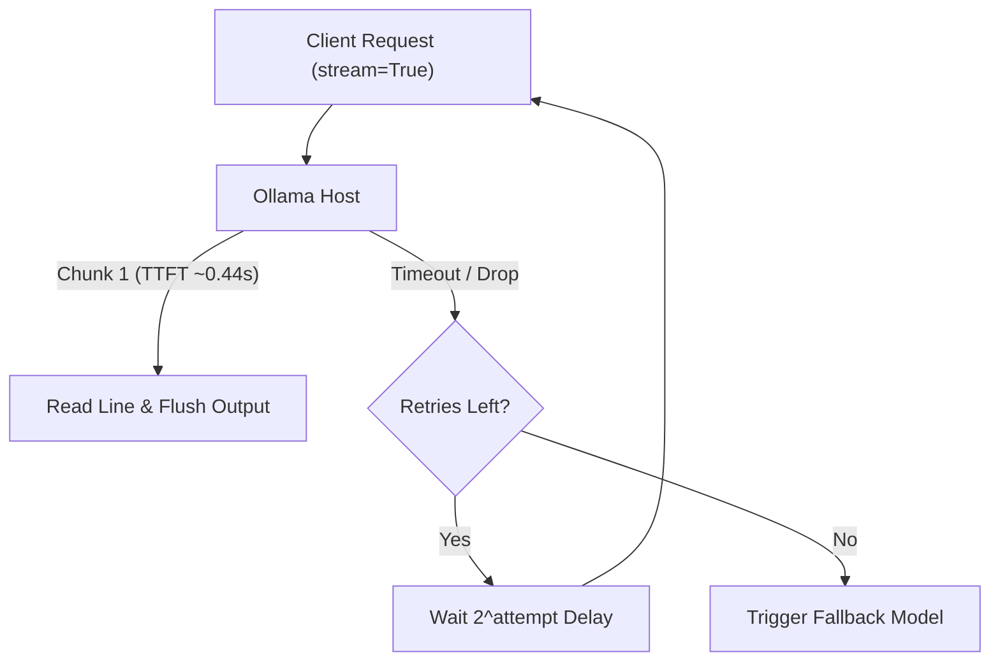

# What I Worked On, My Thoughts & Findings

I spent the last few weeks stripping away framework wrappers to profile raw LLM interactions. My goal was to map agentic AI infrastructure to standard software engineering primitives. Instead of leaning on heavy abstractions, I built raw Python HTTP clients to enforce strict data contracts, implement Server-Sent Events (SSE) token streams, and engineer fault-tolerant gateway routing. What follows is the exact technical breakdown of how I structured these labs and the architectural decisions that separate fragile prototypes from production-ready systems.

## Data & Technical Facts

**Infrastructure & Metrics**
- **Endpoint**: `http://192.168.1.29:11434/api/generate` (Ollama LAN Inference)
- **Models**: Primary `qwen3.6:35b-a3b-65k`, Fallback `qwen3.6:35b-a3b`
- **TTFT**: Wall-clock ms from request send to first JSON chunk. Governs perceived latency.
- **ITL**: Time gap between sequential token chunks during decode.
- **TPS**: `eval_count / (eval_duration_ns / 1e9)`.

**Data Contract & Baseline Client**
```json
{ "model": "qwen3.6:35b-a3b-65k", "prompt": "...", "stream": false, "options": { "temperature": 0.0 } }
```
```python
import json, time, urllib.request
URL = "http://192.168.1.29:11434/api/generate"
payload = {"model": "qwen3.6:35b-a3b-65k", "prompt": "...", "stream": False}
req = urllib.request.Request(URL, data=json.dumps(payload).encode(), headers={"Content-Type": "application/json"})
start = time.time()
with urllib.request.urlopen(req) as resp:
    res = json.loads(resp.read())
    tps = res["eval_count"] / (res["eval_duration"] / 1e9)
```

## Information & System Connections

The progression from blocking RPC to event-driven streaming dictates user experience and reliability. I structured the workflow to move from stateless JSON payloads toward a dynamic SSE transport layer, then wrapped it in a resilient gateway.

**Lab 1 → Lab 2: Latency Shift**
Blocking calls force clients to wait for monolithic payloads, causing 10–30 second frozen windows. Switching to `stream: True` decouples generation from perception. The client parses line-delimited JSON chunks as they arrive, dropping TTFT to ~0.44s.

**Lab 2 → Lab 3: Resilience Patterns**
Raw streams fail silently under network pressure. I wrapped the transport in a retry loop with exponential backoff (`2^attempt`) and fallback routing. This mirrors enterprise patterns for handling transient glitches or HTTP 429/503 limits.



## Knowledge & Key Learnings

**1. Data Contracts Prevent Runtime Crashes**
Defining exact JSON keys before coding eliminated `KeyError` and deserialization bugs. Ollama's API is strict; deviating from the contract breaks parsing immediately. Enforcing schemas at the gateway layer catches issues early.

**2. Streaming is a UX Requirement**
Waiting for full completion breaks trust. Implementing SSE token demuxers with `sys.stdout.flush()` shifts perceived latency to real-time. The trade-off is increased client complexity: partial JSON parsing and buffer management are mandatory.

**3. Exponential Backoff Beats Linear Retries**
Linear retries cause thundering herd problems during server recovery. `2^attempt` naturally spaces requests, giving the inference engine time to clear queues. Adding full jitter in production prevents synchronized retry storms.

**4. CFG Logit Masking Replaces Post-Hoc Validation**
Traditional JSON parsing fails silently on malformed outputs. Modern engines apply Context-Free Grammar (CFG) logit masking during decode, assigning `-∞` probability to invalid tokens. This guarantees schema compliance mathematically, removing retry loops entirely.

## Wisdom & My Take

Stop wrapping everything in frameworks early. I initially reached for LangChain but abandoned it after realizing they abstract away HTTP timeouts, stream buffers, and retry states. Building raw `urllib.request` clients forced me to understand TTFT vs TPS, handle chunk boundaries manually, and implement backoff logic from scratch. That baseline knowledge is what lets me debug production latency spikes later.

If your application requires real-time feedback AND deterministic extraction, combine SSE streaming with CFG-constrained sampling. Streaming handles the UX boundary; CFG handles reliability. Always design your gateway with a secondary execution path ready. Retries fix temporary glitches; fallbacks guarantee uptime during outages. I routed failed primary calls to a smaller local instance rather than letting agents crash mid-task.

My next steps focus on production hardening: implementing multi-provider load balancing, token-bucket rate limiting, and vector RAG for dynamic tool discovery. The foundation is solid. Now it’s about scaling throughput and hardening the pipeline against adversarial inputs.