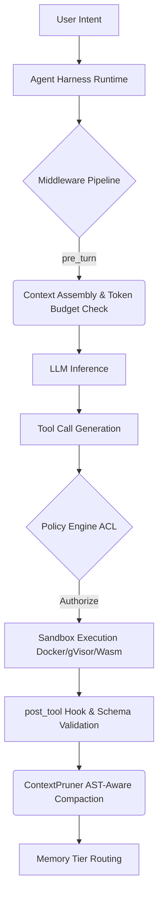

# What I Worked On, My Thoughts & Findings

I spent the last few weeks engineering a deterministic runtime container for autonomous LLM agents. The goal was to strip away agentic buzzwords and map them directly to standard software primitives. I built a pluggable harness that manages lifecycle hooks, enforces sandbox isolation, and routes capabilities via MCP. Below is the technical breakdown of how I wired it together.

## Data & Technical Facts

```python
OLLAMA_URL = "http://192.168.1.29:11434/api/chat"
MODEL_NAME = "qwen3.6:35b-a3b-65k"
PAYLOAD_OPTIONS = {"temperature": 0.0, "stream": False}

TOOL_REGISTRY = {
    "add_numbers": add_numbers,
    "read_database_record": read_database_record
}
```

I mapped core agentic paradigms to concrete primitives: the Agent Harness became an Application Runtime Host, Scaffolding translated to Framework Middleware Infrastructure, and Context Injection was implemented as a Dynamic Metadata Interpolator. For safety, I added a cycle detection primitive using SHA-256 trajectory hashing: `hash(tool_name + tool_args + tool_output)`. The MCP transport layer uses JSON-RPC 2.0 payloads routed over either Stdio IPC or SSE HTTP streams.

## Information & System Connections

The harness operates as a pluggable middleware pipeline. Before inference, `pre_turn` hooks assemble OS metadata and check token budgets. After tool execution, `post_tool` hooks validate schemas and trigger AST-aware pruning. I structured the flow to decouple state management from model reasoning:



MCP servers expose tools as microservice RPC endpoints. Skills (`SKILL.md`) use progressive disclosure, injecting only lightweight YAML frontmatter into the system prompt until domain intent is matched. Memory is strictly tiered: working memory handles immediate payloads, while long-term state persists to vector stores or relational databases.

## Knowledge & Key Learnings

ReAct isn't a framework; it's a ~40-line Python control loop. Frameworks layer heavy abstractions on top of this primitive, which complicates debugging. Decoupling tools from the harness enforces the Single Responsibility Principle—adding capabilities never touches the core loop logic. I learned that naive text truncation causes catastrophic API crashes and the "lost in the middle" phenomenon. AST-aware pruning preserves structural integrity while discarding execution noise. KV-cache alignment also requires static system prompts and tool schemas anchored at the payload start to maintain >90% GPU cache hit rates. Middleware interception is strictly superior to monolithic agent classes for independent lifecycle management.

## Wisdom & My Take

Building autonomous agents isn't about prompting better; it's about engineering deterministic containers around probabilistic models. My pragmatic advice is to resist orchestration frameworks early on. Implement trajectory hashing, ACL policies, and sandbox isolation before writing inference loops. You'll save weeks of debugging opaque internals later. Context window management remains the biggest trade-off: stripping CoT saves budget but kills auditability, while keeping it burns tokens fast. I route thinking to telemetry logs and only inject distilled summaries back into context when necessary. For production, I'm moving toward async execution, adaptive topology switching based on goal complexity, and strict token budget caps enforced at the harness level rather than relying on provider limits. The gap between hobbyist scripts and resilient systems is infrastructure.