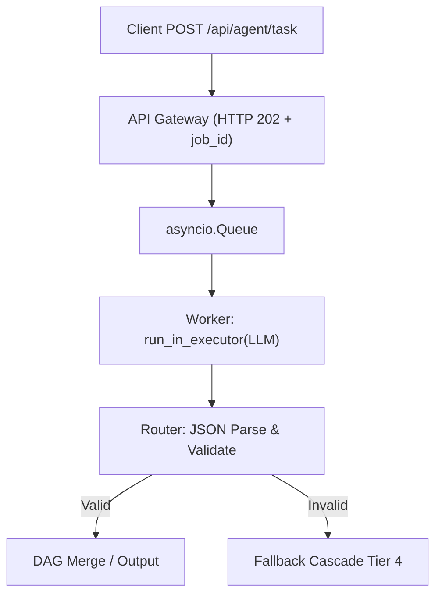

# What I Worked On, My Thoughts & Findings

I spent recent days mapping traditional distributed systems engineering to modern agentic workflows. The industry floods us with AI-specific terminology that obscures well-established software primitives. My goal was to strip away the buzzwords and document exactly how hybrid routing pipelines, cyclical state graphs, and async event-driven execution function under the hood for production systems.

## Data & Technical Facts

I benchmarked latency, cost, and determinism across core components: hardcoded branches run at $0.00 cost with <1ms execution, while LLM router nodes average ~$0.002–$0.01 per call with 300ms–1500ms latency. I enforced strict schema contracts using Pydantic to validate routing outputs:
```python
from pydantic import BaseModel, Field
from typing import Literal
class RouterOutput(BaseModel):
    intent: Literal["billing", "technical", "general_inquiry"]
    confidence_score: float = Field(ge=0.0, le=1.0)
```
For state persistence, I used a lightweight SQLite schema for checkpointing:
```sql
CREATE TABLE checkpoints (thread_id TEXT, step_name TEXT, checkpoint_id INTEGER PRIMARY KEY AUTOINCREMENT, state_data TEXT, timestamp REAL);
```
To handle blocking HTTP calls in an async event loop, I bridged the gap with `run_in_executor`:
```python
loop = asyncio.get_running_loop()
response_bytes = await loop.run_in_executor(None, lambda: urllib.request.urlopen(req, timeout=30).read())
```

## Information & System Connections

Data ingress hits a schema-validated LLM router. Validated JSON dispatches to deterministic downstream subroutines; invalid payloads trigger a four-tier fallback cascade (primary LLM → self-correction retry → secondary lightweight model → hardcoded default). State propagates as an immutable context object, with topological sorting preventing race conditions in parallel branches.

Cyclical workflows require explicit state management. Nodes act as pure functions, edges as conditional evaluators, and reducers merge outputs to prevent concurrency conflicts. Persistent checkpointers serialize state after every step, enabling fault tolerance and time-travel debugging by replaying snapshots at step N. When `node_run_tests` fails, a conditional edge evaluator routes execution back to the refactor node without polluting business logic.

## Knowledge & Key Learnings

I observed three critical architectural patterns. First, strict boundary validation prevents pipeline corruption. Allowing raw model output downstream guarantees state corruption; Pydantic/Zod acts as a circuit breaker for malformed payloads before they reach deterministic processing steps. Second, fallback cascades replace the myth of "perfect" AI routing. Relying on a single router is an anti-pattern; systems must degrade gracefully from high-capability models to deterministic rules when confidence drops or APIs timeout. Third, async decoupling solves the 504 gateway timeout problem fundamentally. Holding open HTTP connections for long-horizon tasks causes thread starvation. Event-driven dispatch with `202 Accepted` status codes shifts architecture from synchronous blocking to pub/sub, while SSE/WebSocket streams push RFC 6902 JSON Patch diffs to clients for progressive UI rendering.

## Wisdom & My Take

Production AI isn't about magical routing; it's about engineered resilience. I prioritize four rules: enforce strict schema contracts at every boundary, build fallback cascades before primary routes, treat state checkpointing as a debugging lifeline rather than an afterthought, and mandate async event streaming for any task exceeding three seconds. Next, I'm migrating the in-memory queue to Redis Streams for horizontal scaling, layering PostgreSQL for distributed locking, and adding OpenTelemetry tracing across nodes. The gap between research demos and production systems bridges through strict contracts, explicit state management, and graceful degradation. Master those primitives, and the agentic layer becomes manageable rather than magical. I'll document the migration to Redis and OpenTelemetry integration in the next round.